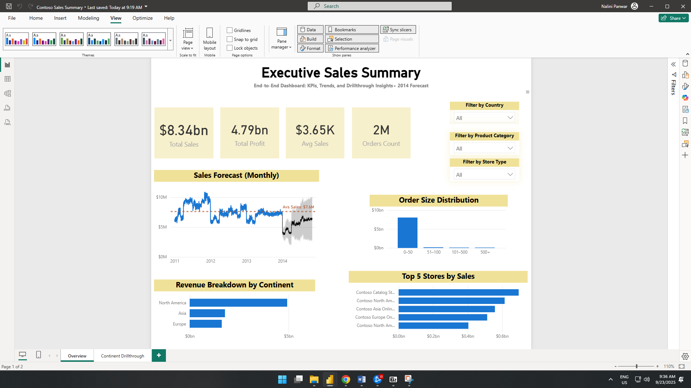
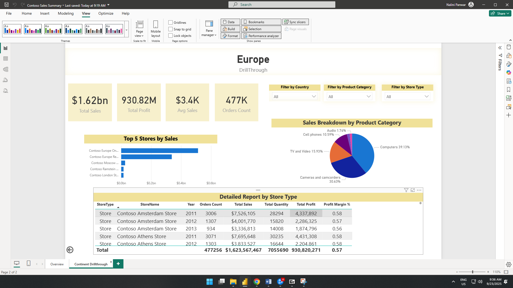

# Executive Sales Summary (Power BI Dashboard)

## Overview
This project analyzes **Contoso’s sales data (2011-2013 actuals with 2014 forecast)**.  
The dashboard provides interactive insights into sales performance, profit margins, order patterns, and regional breakdowns.

---

## Dataset
- **Source:** Microsoft Contoso Sales Dataset  
- **Rows:** around 3 million  
- **Period:** 2011-2013 (forecast applied for 2014)  
- **Tables:** `Sales`, `Products`, `Stores`, `Calendar`, `Geography`

---

## Key Measures
- `Total Sales = SUM(Sales[SalesAmount])`  
- `Total Profit = SUM(Sales[SalesAmount]) - SUM(Sales[TotalCost])`  
- `Profit Margin % = DIVIDE([Total Profit], [Total Sales], 0)`  
- `Orders Count = COUNTROWS(Sales)`  
- `Sales per Store = DIVIDE([Total Sales], DISTINCTCOUNT(Sales[StoreKey]))`  
- `Sales per Order = DIVIDE([Total Sales], [Orders Count])`  

> Full DAX list: **[MEASURES.md](docs/MEASURES.md)**

---

## Custom Columns & Hierarchies
- `MonthSort = YEAR(Calendar[Date]) * 100 + MONTH(Calendar[Date])` (for correct month sorting)  
- `Custom Bin = SWITCH(TRUE(), …)` for order quantity ranges (0–50, 51–100, 101–500, 500+)  
- **Calendar Hierarchy:** Year - Quarter - Month - Month Number

> Details: **[DATA_DICTIONARY.md](docs/DATA_DICTIONARY.md)**

---

## Features
- KPI cards: **Total Sales, Total Profit, Avg Sales, Orders Count**  
- Line chart with **2014 forecast** (Power BI built-in forecasting)  
- Histogram for **Order Size Distribution** (custom bins)  
- Sales breakdown by **Continent, Country, Store Type**  
- Drillthrough page with:
  - **Top 5 Stores by Sales**
  - **Product Category breakdown**
  - **Detailed Profitability table**

---

## Screenshots
### Main Dashboard


### Drillthrough Page


---

## Repository Structure

```plaintext
executive-sales-summary/
├── README.md                       # Project overview
├── docs/                           # Documentation files
│   ├── MEASURES.md                 # DAX measures
│   └── DATA_DICTIONARY.md          # Custom columns & dataset snapshot
├── images/                         # Dashboard screenshots
│   ├── overview.png                # Main dashboard screenshot
│   └── drillthrough.png            # Drillthrough page screenshot
└── Contoso_Sales_Insights.pbix.md  # Link to PBIX file on Google Drive
```
---

## How to Use
1. Download the `.pbix` file:  [Contoso_Sales_Insights.pbix (Google Drive)](https://drive.google.com/file/d/153Bu3TIUcZsC0lIOe50sw5nfqKxJBMvu/view?usp=sharing)  
2. Open in **Power BI Desktop**.  
3. Interact with slicers, visuals and use drillthrough to explore details.

---

## Notes
- Data is **synthetic** (Microsoft Contoso sample).  
- **Actuals:** 2011–2013. **Forecast:** 2014.  
- This repo is intended for demonstration/portfolio use.
  

